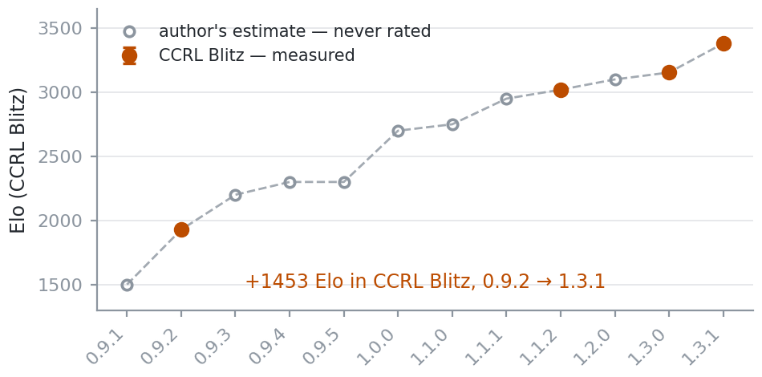
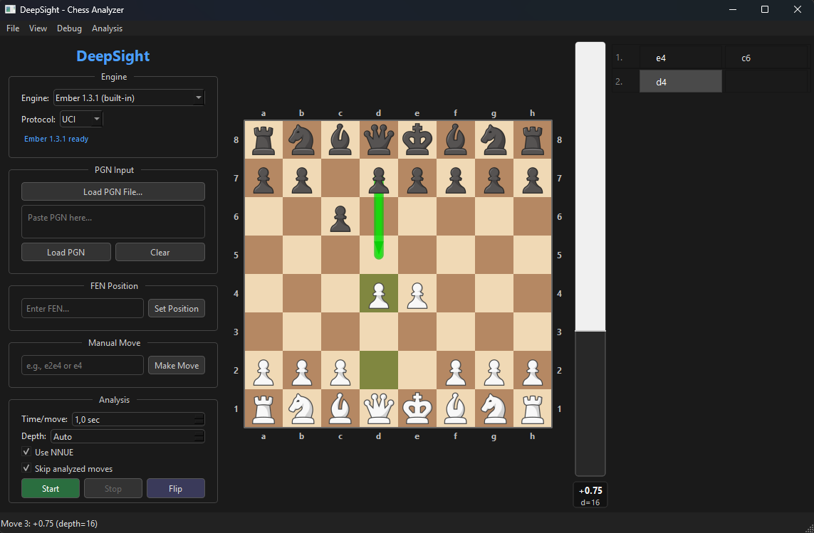
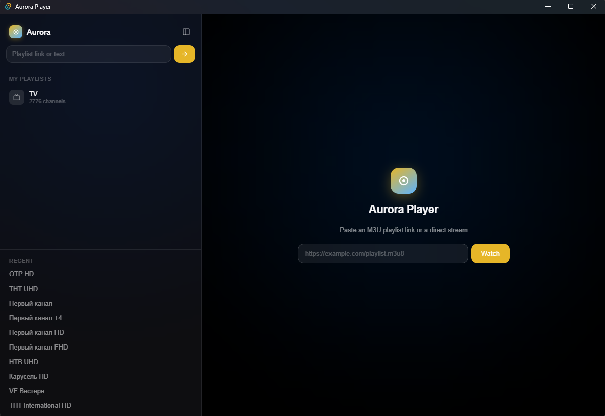

# Daniil

Rust and Python. Mostly chess software.

[Ember](#ember) · [DeepSight](#deepsight) · [Aurora Player](#aurora-player) · [Hollow Knight AI](#hollow-knight-ai) · [Contact](#contact)

## Projects

| | Project | What it is | Built with | Measured |
| :-: | --- | --- | --- | --- |
| 1 | **[Ember](https://github.com/ExxDreamerCode/Ember)** | UCI chess engine | Rust — 31k lines, 57 files | CCRL Blitz **3381 ± 21** over 575 games |
| 2 | **[DeepSight](https://github.com/ExxDreamerCode/DeepSight)** | Chess game analyzer, desktop GUI | Python 3.11, PyQt6 | ships Ember and Stockfish as built-ins |
| 3 | **[Aurora Player](https://github.com/ExxDreamerCode/AuroraPlayer)** | IPTV player for Windows | Tauri 2, Rust, React 19, hls.js | M3U in, channel list out — groups, search, PiP |
| 4 | **[Hollow Knight AI](https://github.com/ADIMIR21/Hollow-Knight-Bot)** | PPO agent learning to fight Pantheon bosses | Python + Stable-Baselines3, C# mod | 19 actions, telemetry at ~60 Hz |

### Ember

UCI chess engine · [repo](https://github.com/ExxDreamerCode/Ember) · [releases](https://github.com/ExxDreamerCode/Ember/releases/latest) · [BUILD.md](https://github.com/ExxDreamerCode/Ember/blob/main/BUILD.md)

Built together with [@starius](https://github.com/starius).

Ember plays on CCRL: **Blitz 3381 ± 21** (575 games), **40/15 3277** (6 games), **FRC 3200 ± 21** — rank 86. The three lists are not comparable with each other.

<picture>
  <source media="(prefers-color-scheme: dark)" srcset="assets/ember-rating-dark.png">
  
</picture>

- **NNUE** — own networks in two formats: V1 half-features with king buckets, optional threat inputs and `CReLU`/`SCReLU`/pairwise activations, V2 a semi-transformer with PSQ and threat function stacks. Compact `ECN1` storage; trained with the repo's PyTorch and Bullet tooling.
- **Search** — quiescence with SEE and delta pruning, transposition table, killer/history/counter moves, Lazy SMP, Syzygy tablebases up to 6 pieces, Polyglot books with an embedded default.
- **Build** — pinned nightly toolchain, reproducible Nix builds, PGO data, a portable Windows bundle, and a `bench` command that reports a reproducible node signature.

### DeepSight

Desktop analyzer for chess games · [repo](https://github.com/ExxDreamerCode/DeepSight)

- Loads PGN files or pasted PGN text, or sets any position by FEN; then scores every move in centipawns or mate.
- Classifies moves (book, best, inaccuracy, blunder), draws the eval bar and the engine's suggested move, and gives a live eval without a full run.
- Navigation from the keyboard: <kbd>←</kbd> <kbd>→</kbd> for moves, <kbd>Home</kbd> <kbd>End</kbd> for the ends of the game. Any UCI engine can be attached, not only the built-ins.
- Ember and Stockfish come along on both platforms: a Nix derivation on Linux, or PyInstaller via `deepsight.spec` into a `.exe` on Windows, with `Engines/download-engines.bat` fetching the binaries.

### Aurora Player

Native IPTV player for Windows · [repo](https://github.com/ExxDreamerCode/AuroraPlayer)

- Paste an M3U playlist link and it loads every channel, or paste a direct stream link and it creates a single one.
- Reads `tvg-logo` and `group-title` out of the playlist, so channels arrive with logos and groups; adds search, favourites, a 20-entry history and playlists that survive a restart.
- HLS through hls.js with a direct-URL fallback, plus picture-in-picture. Ships as a portable `.exe` and an NSIS installer.

### Hollow Knight AI

Reinforcement learning against Hollow Knight bosses · [repo](https://github.com/ADIMIR21/Hollow-Knight-Bot)

Built together with [Adimir](https://github.com/ADIMIR21).

- A C# mod exports telemetry over the `\\.\pipe\hk_ai_mod` named pipe at ~60 Hz — player and boss position, HP, soul, state flags, hit counters — and a watchdog repairs scene transitions that hang.
- The Python side is a Gymnasium environment trained with PPO (Stable-Baselines3): 19 discrete actions, rewards and episode logic per boss, checkpoints laid out per boss.
- Restarts straight into any Godhome boss by alias or scene name, can freeze the fight for debugging, and reports the game's own arena state instead of assuming the latched boss is the only one left.

## Now

- Ember — search tuning and network training.
- DeepSight — bug fixes.
- Hollow Knight AI — training runs against the harder Pantheon bosses.

## Contact

Telegram — [@Dreamer_hehehe](https://t.me/Dreamer_hehehe)

Русская версия: [README.ru.md](README.ru.md)
